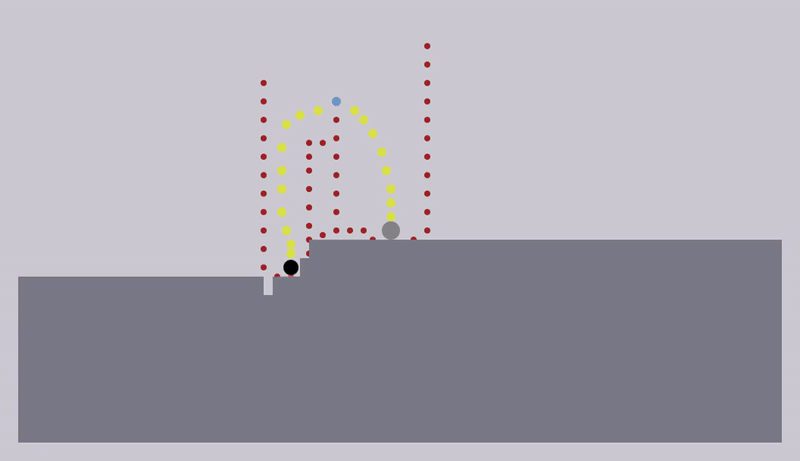

# NPP-RL Agent

A Deep Reinforcement Learning Agent for the game N++, implementing PPO (Proximal Policy Optimization) using Stable Baselines3 with a custom N++ simulation environment.

## Project Overview

This project trains an agent to play the game [N++](https://en.wikipedia.org/wiki/N%2B%2B). The agent learns to navigate complex, physics-based levels, collect gold, activate switches, and reach exits by interacting with a custom Gym-compatible environment derived from the `nclone` simulator.

The agent architecture incorporates several features informed by recent deep reinforcement learning research to enhance performance, generalization, and sample efficiency.

## Core Agent Features & Architecture

The PPO agent leverages a multi-input policy capable of processing visual and vector-based game state information. Key architectural components include:

### 1. Observation Space & Processing

The agent receives multi-modal observations:

*   **Player-Centric Visual Frames**:
    *   Dimensions: 84x84 pixels.
    *   Temporal Stacking: 12 consecutive frames are stacked to provide temporal context.
        *   `TEMPORAL_FRAMES = 12` (defined in `nclone/nclone/nclone_environments/basic_level_no_gold/constants.py`).
    *   Preprocessing: Grayscale conversion, centering on the player, cropping, and normalization.
    *   Augmentation: Random cutout is applied to player frames with a 50% chance to improve generalization (inspired by DeVries & Taylor, 2017, "Improved Regularization of Convolutional Neural Networks with Cutout").

*   **Global View**:
    *   A downsampled 176x100 pixel grayscale view of the entire level.

*   **Game State Vector**: A low-dimensional vector containing:
    *   Ninja physics state (position, velocity, airborne/walled status, jump duration, applied forces).
    *   Status of critical entities (e.g., exit door, switches).
    *   Normalized vectors from the ninja to key objectives (e.g., active switch, exit).
    *   Time remaining in the episode.

### 2. Feature Extraction

Multiple feature extractor architectures are available in the consolidated `npp_rl/feature_extractors/` package:

*   **`FeatureExtractor` (Recommended for temporal data)**:
    *   Employs 3D convolutions over the 12 stacked player-centric frames to directly model spatiotemporal patterns.
        *   Input shape: `(Batch, 1, TemporalFrames, Height, Width)`.
    *   Uses varied 3D convolutional kernel sizes (e.g., `(4,7,7)`, `(3,5,5)`) and strides to capture features at multiple temporal and spatial scales.
    *   Processes the global view with a separate 2D CNN.
    *   Includes adaptive pooling layers to ensure fixed-size outputs before fusion.

Both extractors process the game state vector through a dedicated Multi-Layer Perceptron (MLP). The features from visual inputs and the game state vector are then fused and passed to the policy and value networks.

*   **`HierarchicalMultimodalExtractor` (Advanced - Task 2.1)**:
    *   Implements multi-resolution graph neural networks for structural level understanding.
    *   **Three resolution levels**: Sub-cell (6px), Tile (24px), Region (96px) for both local precision and strategic planning.
    *   **DiffPool GNN**: Differentiable graph pooling with learnable hierarchical representations.
    *   **Multi-scale fusion**: Context-aware attention mechanisms that adapt to ninja physics state.
    *   **Auxiliary losses**: Link prediction, entropy, and orthogonality regularization for stable training.
    *   Integrates seamlessly with existing CNN/MLP processing for comprehensive multimodal understanding.

### 3. Network Architecture & Hyperparameters

*   **Policy and Value Networks**:
    *   The PPO agent uses separate MLP heads for the policy (actor) and value (critic) functions, following the feature extraction stage.
    *   Network Size: Hidden layers are configured as `[256, 256, 128]` (`NET_ARCH_SIZE` in `agents/hyperparameters/ppo_hyperparameters.py`).
*   **Key PPO Hyperparameters** (tuned values in `agents/hyperparameters/ppo_hyperparameters.py`):
    *   `n_steps`: 1024 (Number of steps per environment per update)
    *   `batch_size`: 256 (Minibatch size for optimization)
    *   `gamma`: 0.999 (Discount factor)
    *   `learning_rate`: Linearly decayed, typically from `3e-4` to `1e-6`.
    *   Other parameters such as `gae_lambda`, `clip_range`, `ent_coef`, and `vf_coef` are also defined.

### 4. Adaptive Exploration Strategies

To encourage efficient exploration and improve learning in sparse reward environments, the agent can utilize an `AdaptiveExplorationManager` (from `agents/adaptive_exploration.py`). This system combines:

*   **Intrinsic Curiosity Module (ICM)**:
    *   Based on Pathak et al. (2017), "Curiosity-driven Exploration by Self-supervised Prediction."
    *   The module consists of a forward model (predicting the next state's feature representation given the current state and action) and an inverse model (predicting the action taken between two consecutive states).
    *   The prediction error of the forward model serves as an intrinsic reward signal, encouraging the agent to visit states where its understanding of the environment dynamics is poor.
*   **Novelty Detection**:
    *   Employs a count-based approach where states (discretized player positions) are tracked.
    *   A novelty bonus is awarded for visiting less frequently encountered states, decaying over time. This is inspired by classic count-based exploration algorithms.
*   **Adaptive Scaling**:
    *   The overall magnitude of the exploration bonus (combined from ICM and novelty) is dynamically adjusted based on the agent's training progress (e.g., rate of extrinsic reward improvement).

### 5. Action Space

The agent interacts with the environment using a discrete action set:
*   NOOP (No action)
*   Left
*   Right
*   Jump
*   Jump + Left
*   Jump + Right

### 6. Reward System

The extrinsic reward signal from the environment is designed to guide the agent towards completing levels efficiently. It typically includes:
*   Small penalty for each time step (encouraging speed).
*   Positive reward for collecting gold (if applicable to the specific environment variant).
*   Positive reward for activating switches.
*   Large positive reward for reaching the exit.
*   Large negative penalty for dying.
*   Exploration rewards at multiple spatial scales.

## Project Structure

Current layout focused on Phase 1:

- `npp_rl/`
  - `agents/`
    - `enhanced_training.py`: Main training entrypoint with CLI; uses PPO, 3D/2D extractors, vec envs, logging.
  - `feature_extractors/`
    - `temporal.py`: `TemporalFeatureExtractor` with 3D CNNs for temporal modeling.
    - `multimodal.py`: `MultimodalExtractor` and `MultimodalGraphExtractor` for complex observations.
    - `__init__.py`: Unified interface with factory functions for easy extractor selection.
    - `adaptive_exploration.py`: Optional curiosity/novelty exploration manager and helpers.
    - `hyperparameters/ppo_hyperparameters.py`: Tuned PPO defaults and `NET_ARCH_SIZE`.
    - `npp_agent_ppo.py`: Secondary training utilities (create/train/eval/record) kept for compatibility.
  - (other subpackages may be added in later phases)
- Top-level scripts
  - `ppo_train.py`: Thin wrapper to launch PPO via `npp_rl.agents.npp_agent_ppo.start_training`.
  - `tools/`: Small utilities (e.g., `convert_actions.py`, `rotate_videos.py`).
  - `archive/`: Deprecated/experimental scripts kept for reference; not used in Phase 1.

See `archive/README.md` for details on what was moved and why.

## Training the Agent

The primary script for training the agent with all features is `npp_rl/agents/enhanced_training.py`.

### Prerequisites

#### System Requirements

Before starting, ensure you have:
- Python 3.8 or higher
- Git
- pip (Python package installer)
- System dependencies for PyCairo:
  ```bash
  sudo apt install libcairo2-dev pkg-config python3-dev
  ```

#### Setting up the Development Environment

1. Clone this repository:
   ```bash
   git clone https://github.com/tetramputechture/npp-rl.git
   cd npp-rl
   ```

2. (Optional but recommended) Create a virtual environment:
   ```bash
   python -m venv venv
   source venv/bin/activate  # On Windows, use: venv\Scripts\activate
   ```

3. Install the `nclone` simulator:
   ```bash
   # Navigate to the directory containing npp-rl
   cd ..
   git clone https://github.com/tetramputechture/nclone.git
   cd nclone
   pip install -e .
   cd ../npp-rl
   ```

4. Install project dependencies:
   ```bash
   pip install -r requirements.txt
   ```

### Starting a Training Run

**Recommended Quick Start:**
This command starts training using the `3DFeatureExtractor`, 12-frame stacking, adaptive exploration, and optimized hyperparameters, utilizing 64 parallel environments.

```bash
python -m npp_rl.agents.enhanced_training --num_envs 64 --total_timesteps 10000000
```

**Command-Line Options for `enhanced_training.py`:**
The `enhanced_training.py` script offers various options:

```bash
python -m npp_rl.agents.enhanced_training --help
```

Key options include:
*   `--num_envs`: Number of parallel simulation environments (default: 64).
*   `--total_timesteps`: Total number of training steps (default: 10,000,000).
*   `--load_model`: Path to a previously saved model checkpoint to resume training.
*   `--render_mode`: Set to `human` for visual rendering (forces `num_envs=1`). Default is `rgb_array`.
*   `--disable_exploration`: Turn off the adaptive exploration system.

**Example - Resuming Training:**
```bash
python -m npp_rl.agents.enhanced_training --load_model ./training_logs/enhanced_ppo_training/session-MM-DD-YYYY-HH-MM-SS/best_model/best_model.zip --num_envs 32
```

The original training utilities in `npp_rl/agents/npp_agent_ppo.py` remain for compatibility; prefer `enhanced_training.py` going forward.

### Hyperparameter Tuning

Automated hyperparameter optimization is available via Optuna. Scripts `ppo_tune.py` (for standard PPO features) and `recurrent_ppo_tune.py` (if a recurrent version is being tested) can be used. These scripts typically optimize:
*   Learning rate and schedule
*   Network architecture choices (within predefined options)
*   LSTM hidden size (for recurrent policies)
*   PPO-specific parameters (`batch_size`, `n_steps`, GAE, clip ranges, coefficients).

Tuning results are saved in `training_logs/tune_logs/` and `training_logs/tune_results_<timestamp>/`.

## Monitoring and Logging

*   **Tensorboard**: Training progress, including rewards, losses, and exploration metrics, can be monitored using Tensorboard:
    ```bash
    tensorboard --logdir ./training_logs/enhanced_ppo_training/
    ```
    (Adjust log directory path based on the session timestamp).
*   **Log Files**: Detailed logs, training configurations, and model checkpoints are saved under:
    `./training_logs/enhanced_ppo_training/session-<timestamp>/`
    This includes:
    *   `training_config.json`: Hyperparameters and settings for the run.
    *   `eval/`: Logs from evaluation callbacks.
    *   `tensorboard/`: Tensorboard event files.
    *   `best_model/`: The best model saved during training based on evaluation performance.
    *   `final_model/`: The model saved at the very end of training.

## Example Agent Performance

(This section can be updated with new GIFs or performance metrics as the agent develops further)

This is an example of a trained agent completing a non-trivial level:

*This agent was trained on a specific level configuration.*

Work on a generalized agent capable of playing a wide variety of N++ levels is an ongoing focus.

## Key Research References

The architecture and training procedures are informed by principles and findings from various research papers, including:

*   Schulman, J., Wolski, F., Dhariwal, P., Radford, A., & Klimov, O. (2017). Proximal Policy Optimization Algorithms.
*   Pathak, D., Agrawal, P., Efros, A. A., & Darrell, T. (2017). Curiosity-driven Exploration by Self-supervised Prediction.
*   Cobbe, K., Hesse, C., Hilton, J., & Schulman, J. (2020). Leveraging Procedural Generation to Benchmark Reinforcement Learning. (Influenced choices for network scaling and temporal modeling).
*   Ji, S., Xu, W., Yang, M., & Yu, K. (2013). 3D convolutional neural networks for human action recognition. (Early work on 3D CNNs relevant to spatiotemporal feature learning).
*   DeVries, T., & Taylor, G. W. (2017). Improved Regularization of Convolutional Neural Networks with Cutout.
*   Ecoffet, A., Huizinga, J., Lehman, J., Stanley, K. O., & Clune, J. (2019). Go-Explore: a New Approach for Hard-Exploration Problems. (Inspired adaptive novelty components).
*   Mnih, V., et al. (2013). Playing Atari with Deep Reinforcement Learning. (Foundation for CNNs in RL).
*   Kaplan, J., et al. (2020). Scaling Laws for Neural Language Models. (General insights into model scaling).
*   Ying, R., et al. (2018). Hierarchical Graph Representation Learning with Differentiable Pooling. (DiffPool implementation for hierarchical GNNs).
*   Hamilton, W., Ying, Z., & Leskovec, J. (2017). Inductive Representation Learning on Large Graphs. (GraphSAGE foundation for graph neural networks).

## Advanced Features: Hierarchical Graph Processing (Task 2.1)

The project now includes state-of-the-art hierarchical graph neural networks for structural level understanding, implementing multi-resolution processing that enables both precise local movement decisions and strategic global planning.

### Multi-Resolution Graph Architecture

The hierarchical graph system processes N++ levels at three resolution levels:

*   **Sub-cell Level (6px resolution)**: Fine-grained movement precision with ~15,456 nodes
*   **Tile Level (24px resolution)**: Standard game mechanics with ~966 nodes  
*   **Region Level (96px resolution)**: Strategic planning with ~60 nodes

### Key Components

*   **Hierarchical Graph Builder** (`nclone/graph/hierarchical_builder.py`):
    *   Creates multi-resolution representations through graph coarsening
    *   Maintains cross-scale connectivity for information flow
    *   Aggregates features from fine to coarse levels with statistical summaries

*   **DiffPool GNN** (`npp_rl/models/diffpool_gnn.py`):
    *   Implements differentiable graph pooling with soft cluster assignments
    *   Enables end-to-end training of hierarchical representations
    *   Includes auxiliary losses (link prediction, entropy, orthogonality) for stable training

*   **Multi-Scale Fusion** (`npp_rl/models/multi_scale_fusion.py`):
    *   Context-aware attention mechanisms that adapt to ninja physics state
    *   Learned routing between resolution levels
    *   Dynamic scale selection based on current task requirements

*   **Hierarchical Multimodal Extractor** (`npp_rl/feature_extractors/hierarchical_multimodal.py`):
    *   Integrates hierarchical graph processing with existing CNN/MLP architectures
    *   Supports auxiliary loss training for improved representations
    *   Graceful fallback when hierarchical graph data is unavailable

### Usage Example

```python
from npp_rl.feature_extractors.hierarchical_multimodal import create_hierarchical_multimodal_extractor

# Create hierarchical feature extractor
extractor = create_hierarchical_multimodal_extractor(
    observation_space=env.observation_space,
    features_dim=512,
    use_hierarchical_graph=True
)

# Use in PPO training with auxiliary losses
policy_kwargs = {
    'features_extractor_class': type(extractor),
    'features_extractor_kwargs': {
        'enable_auxiliary_losses': True,
        'hierarchical_hidden_dim': 128,
        'fusion_dim': 256
    }
}

model = PPO(
    policy="MultiInputPolicy",
    env=env,
    policy_kwargs=policy_kwargs,
    # ... other parameters
)
```

For detailed implementation information, see `TASK_2_1_IMPLEMENTATION_SUMMARY.md`.

## Dependencies and Installation

### System Requirements

- Python 3.8 or higher
- System dependencies for PyCairo (a dependency of `nclone`):
  ```sh
  sudo apt install libcairo2-dev pkg-config python3-dev
  ```

### Installing Dependencies

1. First, ensure the `nclone` environment is installed from a local sibling directory:
   ```bash
   # Navigate to the directory containing npp-rl
   cd /path/to/parent/directory
   git clone https://github.com/tetramputechture/nclone.git
   cd nclone
   pip install -e .
   cd ../npp-rl
   ```

2. Install Python dependencies using pip:
   ```bash
   pip install -r requirements.txt
   ```

The `requirements.txt` file includes all necessary Python packages:
- `numpy`: For numerical computations
- `torch`: Deep learning framework
- `opencv-python`: Image processing
- `pillow`: Image handling
- `gymnasium`: Environment interface
- `stable-baselines3` and `sb3-contrib`: RL algorithms
- `optuna`: Hyperparameter tuning
- `tensorboard`: Training visualization
- `imageio`: Video recording
- `albumentations`: Image augmentations
- `pytest`: Testing framework

## Testing

The project uses pytest for testing. Tests are organized in the `tests/` directory and cover various aspects of the codebase including:
- Movement classification and trajectory calculations
- Phase 2 training components
- Vectorization utilities
- Integration tests

### Running Tests

To run all tests:
```bash
pytest tests/
```

To run a specific test file:
```bash
pytest tests/test_vectorization.py
```

To run tests with more detailed output:
```bash
pytest -v tests/
```

To run tests and show print statements (useful for debugging):
```bash
pytest -s tests/
```

### Test Categories

1. **Basic Tests** (`test_phase2_basic.py`):
   - Core functionality tests
   - Basic environment interactions
   - Simple reward calculations

2. **Integration Tests** (`test_phase2_integration.py`):
   - End-to-end training scenarios
   - Environment-agent interactions
   - Multi-component functionality

3. **Movement and Physics** (`test_movement_classifier_comprehensive.py`, `test_trajectory_calculator_comprehensive.py`):
   - Movement classification accuracy
   - Trajectory calculations
   - Physics system integration

4. **Vectorization** (`test_vectorization.py`):
   - Parallel environment handling
   - State vectorization
   - Performance optimizations


### Coding Standards

Standards are documented in the `.cursor/rules` directory. When you are writing code, you should follow these standards.

### Linting

Linting is done using ruff. You can run the following command to lint the code:
```bash
make lint
```

You can also run the following command to fix linting issues:
```bash
make fix
```

You can also run the following command to remove unused imports:
```bash
make imports
```
