# Mermaid Diagram Instructions: NPP-RL Agent Architecture

This document provides instructions for generating Mermaid diagrams specifically focused on the NPP-RL agent architecture and its HGT-based multimodal feature extraction system.

## Agent-Specific Architecture Diagrams

### 1. Complete NPP-RL Agent Architecture

### 2. Heterogeneous Graph Transformer (HGT) Detail - PRIMARY

### 3. Hierarchical Graph Neural Network Detail - SECONDARY

### 3. Training Loop and Data Flow

```mermaid
graph LR
    subgraph EPISODE ["🎮 Episode Execution"]
        RESET["Environment Reset<br/>Initial State"]
        STEP["Environment Step<br/>Action → Observation"]
        COLLECT["Experience Collection<br/>Trajectory Building"]
    end
    
    subgraph PROCESSING ["🔄 Batch Processing"]
        BATCH_PREP["Batch Preparation<br/>Trajectory Segmentation"]
        ADVANTAGE["Advantage Estimation<br/>GAE Computation"]
        NORMALIZE["Normalization<br/>Observation Preprocessing"]
    end
    
    subgraph OPTIMIZATION ["⚡ Optimization"]
        FORWARD["Forward Pass<br/>Policy + Value Prediction"]
        LOSS_COMP["Loss Computation<br/>PPO + Auxiliary Losses"]
        BACKWARD["Backward Pass<br/>Gradient Computation"]
        UPDATE["Parameter Update<br/>Adam Optimizer"]
    end
    
    subgraph EVALUATION ["📊 Evaluation & Logging"]
        METRICS["Metrics Computation<br/>Rewards, Success Rate"]
        LOGGING["Logging & Visualization<br/>TensorBoard, Wandb"]
        CHECKPOINT["Model Checkpointing<br/>Best Model Saving"]
    end
    
    RESET --> STEP
    STEP --> COLLECT
    COLLECT --> BATCH_PREP
    BATCH_PREP --> ADVANTAGE
    ADVANTAGE --> NORMALIZE
    NORMALIZE --> FORWARD
    FORWARD --> LOSS_COMP
    LOSS_COMP --> BACKWARD
    BACKWARD --> UPDATE
    UPDATE --> METRICS
    METRICS --> LOGGING
    LOGGING --> CHECKPOINT
    CHECKPOINT --> RESET
    
    %% Styling
    classDef episode fill:#4CAF50,stroke:#2E7D32,stroke-width:2px,color:#fff
    classDef processing fill:#2196F3,stroke:#1976D2,stroke-width:2px,color:#fff
    classDef optimization fill:#FF5722,stroke:#D84315,stroke-width:2px,color:#fff
    classDef evaluation fill:#9C27B0,stroke:#7B1FA2,stroke-width:2px,color:#fff
    
    class EPISODE episode
    class PROCESSING processing
    class OPTIMIZATION optimization
    class EVALUATION evaluation
```

### 4. Feature Extractor Component Breakdown

## Usage Instructions

### Generating Diagrams
1. Copy the desired Mermaid code block
2. Use any Mermaid-compatible tool:
   - **Online**: https://mermaid.live/
   - **VS Code**: Mermaid extension
   - **CLI**: `mmdc -i input.mmd -o output.png`

### Customization
- Modify colors by changing `classDef` statements
- Add/remove components as architecture evolves
- Update connections to reflect data flow changes
- Adjust layout by changing graph direction (`TB`, `LR`, etc.)

### Integration
- Include generated diagrams in documentation
- Reference in README files
- Use in presentations and papers
- Embed in technical specifications

This provides comprehensive visual documentation of the NPP-RL agent's hierarchical multimodal architecture.