# NPP-RL Project Architecture: Complete Mermaid Diagram Guide

This document provides comprehensive Mermaid diagram instructions for visualizing the entire NPP-RL project architecture. The diagrams progress from a global system overview to detailed component breakdowns, showcasing the consolidated HGT-based multimodal architecture.

## Table of Contents

1. [Global System Architecture](#1-global-system-architecture)
2. [NPP-RL Agent Architecture](#2-npp-rl-agent-architecture)
3. [HGT Multimodal Feature Extractor (PRIMARY)](#3-hgt-multimodal-feature-extractor-primary)
4. [Hierarchical Feature Extractor (SECONDARY)](#4-hierarchical-feature-extractor-secondary)
5. [NClone Environment System](#5-nclone-environment-system)
6. [Graph Processing Pipeline](#6-graph-processing-pipeline)
7. [Training and Exploration Systems](#7-training-and-exploration-systems)
8. [Data Flow and Integration](#8-data-flow-and-integration)

---

## 1. Global System Architecture

This diagram shows the complete NPP-RL project ecosystem, including both repositories and their consolidated architectures.


---

## 2. NPP-RL Agent Architecture

This diagram focuses on the complete RL agent architecture, showing the data flow from environment observations through feature extraction to policy decisions.

```mermaid
graph TB
    subgraph ENVIRONMENT ["🎮 NClone Environment Interface"]
        ENV_STATE["Environment State<br/>Physics + Entities + Level"]
        REWARD["Reward Signal<br/>Goal Achievement<br/>Survival Bonus"]
        DONE["Episode Termination<br/>Success/Failure/Timeout"]
    end
    
    subgraph OBSERVATIONS ["📊 Multi-modal Observations"]
        VISUAL_FRAMES["Visual Frames<br/>84x84x12 Stack<br/>Player-centric View<br/>Temporal Context"]
        GLOBAL_VIEW["Global View<br/>176x100 Downsampled<br/>Full Level Overview<br/>Strategic Context"]
        GAME_STATE["Game State Vector<br/>Physics State<br/>Entity Status<br/>Objective Progress"]
        GRAPH_REPR["Heterogeneous Graph<br/>Node Types: Grid/Entity/Hazard<br/>Edge Types: Movement/Functional<br/>Structural Representation"]
    end
    
    subgraph FEATURE_EXTRACTION ["🔍 Feature Extraction (Configurable)"]
        subgraph HGT_PRIMARY ["🌟 HGT Multimodal Extractor (PRIMARY)"]
            subgraph HGT_VISUAL ["Visual Processing"]
                HGT_CNN_3D["3D CNN Branch<br/>Temporal Modeling<br/>Spatiotemporal Features"]
                HGT_CNN_2D["2D CNN Branch<br/>Global Context<br/>Spatial Features"]
            end
            
            subgraph HGT_GRAPH ["HGT Graph Processing"]
                HGT_ENCODER["Heterogeneous Graph Transformer<br/>Type-specific Attention<br/>Multi-head Processing<br/>Entity-aware Embeddings"]
                NODE_TYPE_PROC["Node Type Processing<br/>Grid Cells, Entities<br/>Hazards, Switches"]
                EDGE_TYPE_PROC["Edge Type Processing<br/>Movement: walk/jump/fall<br/>Functional: activate/trigger"]
            end
            
            subgraph HGT_FUSION ["Advanced Multimodal Fusion"]
                CROSS_MODAL_ATTN["Cross-modal Attention<br/>Spatial Awareness<br/>Type-aware Integration"]
                HGT_FUSION_LAYER["Feature Fusion<br/>HGT-enhanced Integration"]
            end
        end
        
        subgraph HIERARCHICAL_SECONDARY ["⭐ Hierarchical Extractor (SECONDARY)"]
            subgraph HIER_VISUAL ["Visual Processing"]
                HIER_CNN_3D["3D CNN Branch<br/>Temporal Processing"]
                HIER_CNN_2D["2D CNN Branch<br/>Global Processing"]
            end
            
            subgraph HIER_GRAPH ["Multi-resolution Graph Processing"]
                GNN_SUBCELL["Sub-cell GNN<br/>6px Resolution<br/>Fine Details"]
                GNN_TILE["Tile GNN<br/>24px Resolution<br/>Navigation"]
                GNN_REGION["Region GNN<br/>96px Resolution<br/>Strategy"]
                DIFFPOOL["DiffPool Layers<br/>Hierarchical Pooling<br/>Learnable Coarsening"]
            end
            
            subgraph HIER_FUSION ["Context-aware Fusion"]
                HIER_ATTENTION["Physics-adaptive Attention<br/>Dynamic Weighting"]
                HIER_FUSION_LAYER["Multi-scale Integration"]
            end
        end
        
        subgraph STATE_PROCESSING ["State Processing (Shared)"]
            MLP_STATE["MLP Branch<br/>Game State Processing<br/>Physics Features"]
        end
    end
    
    subgraph PPO_AGENT ["🧠 PPO Agent"]
        POLICY_HEAD["Policy Head (Actor)<br/>Action Probabilities<br/>Discrete Action Space<br/>Movement Commands"]
        VALUE_HEAD["Value Head (Critic)<br/>State Value Estimation<br/>Advantage Calculation<br/>Return Prediction"]
    end
    
    subgraph EXPLORATION ["🔍 Adaptive Exploration System"]
        ICM["Intrinsic Curiosity Module<br/>Forward/Inverse Models<br/>Prediction Error Reward"]
        NOVELTY["Novelty Detection<br/>Count-based Exploration<br/>State Visit Tracking"]
        ADAPTIVE_SCALE["Adaptive Scaling<br/>Dynamic Bonus Adjustment<br/>Exploration Decay"]
    end
    
    subgraph TRAINING ["🎯 Training Components"]
        EXPERIENCE_BUFFER["Experience Buffer<br/>Trajectory Collection<br/>GAE Computation<br/>Advantage Estimation"]
        PPO_LOSS["PPO Loss Function<br/>Policy + Value + Entropy<br/>Clipped Objective<br/>KL Divergence"]
        OPTIMIZER["Adam Optimizer<br/>Learning Rate Scheduling<br/>Gradient Clipping<br/>Weight Updates"]
    end
    
    %% Data Flow
    ENV_STATE --> OBSERVATIONS
    VISUAL_FRAMES --> HGT_CNN_3D
    VISUAL_FRAMES --> HIER_CNN_3D
    GLOBAL_VIEW --> HGT_CNN_2D
    GLOBAL_VIEW --> HIER_CNN_2D
    GAME_STATE --> MLP_STATE
    GRAPH_REPR --> HGT_ENCODER
    GRAPH_REPR --> GNN_SUBCELL
    GRAPH_REPR --> GNN_TILE
    GRAPH_REPR --> GNN_REGION
    
    %% HGT Path
    HGT_CNN_3D --> CROSS_MODAL_ATTN
    HGT_CNN_2D --> CROSS_MODAL_ATTN
    HGT_ENCODER --> CROSS_MODAL_ATTN
    MLP_STATE --> CROSS_MODAL_ATTN
    CROSS_MODAL_ATTN --> HGT_FUSION_LAYER
    
    %% Hierarchical Path
    HIER_CNN_3D --> HIER_ATTENTION
    HIER_CNN_2D --> HIER_ATTENTION
    GNN_SUBCELL --> DIFFPOOL
    GNN_TILE --> DIFFPOOL
    GNN_REGION --> DIFFPOOL
    DIFFPOOL --> HIER_ATTENTION
    MLP_STATE --> HIER_ATTENTION
    HIER_ATTENTION --> HIER_FUSION_LAYER
    
    %% Policy and Training
    HGT_FUSION_LAYER --> POLICY_HEAD
    HGT_FUSION_LAYER --> VALUE_HEAD
    HIER_FUSION_LAYER --> POLICY_HEAD
    HIER_FUSION_LAYER --> VALUE_HEAD
    
    POLICY_HEAD --> EXPLORATION
    ICM --> ADAPTIVE_SCALE
    NOVELTY --> ADAPTIVE_SCALE
    ADAPTIVE_SCALE --> EXPERIENCE_BUFFER
    
    EXPERIENCE_BUFFER --> PPO_LOSS
    PPO_LOSS --> OPTIMIZER
    OPTIMIZER --> POLICY_HEAD
    OPTIMIZER --> VALUE_HEAD
    
    %% Styling
    classDef primary fill:#4CAF50,stroke:#2E7D32,stroke-width:3px,color:#fff
    classDef secondary fill:#2196F3,stroke:#1976D2,stroke-width:2px,color:#fff
    classDef processing fill:#9C27B0,stroke:#7B1FA2,stroke-width:2px,color:#fff
    classDef training fill:#FF5722,stroke:#D84315,stroke-width:2px,color:#fff
    classDef environment fill:#607D8B,stroke:#455A64,stroke-width:2px,color:#fff
    
    class HGT_PRIMARY,HGT_ENCODER,CROSS_MODAL_ATTN,HGT_FUSION_LAYER primary
    class HIERARCHICAL_SECONDARY,DIFFPOOL,HIER_ATTENTION,HIER_FUSION_LAYER secondary
    class OBSERVATIONS,STATE_PROCESSING,MLP_STATE processing
    class TRAINING,PPO_LOSS,OPTIMIZER,EXPERIENCE_BUFFER training
    class ENVIRONMENT,ENV_STATE,REWARD,DONE environment
```



---

## 3. HGT Multimodal Feature Extractor (PRIMARY)

This diagram provides detailed insight into the Heterogeneous Graph Transformer architecture, which is the primary and recommended approach.


---

## 4. Hierarchical Feature Extractor (SECONDARY)

This diagram shows the hierarchical multi-resolution approach as a secondary architecture option.


---

## 5. NClone Environment System

This diagram details the simulation environment and its integration with the RL agent.

```mermaid
graph TB
    subgraph NCLONE_SYSTEM ["🎮 NClone Environment System"]
        subgraph CORE_SIMULATION ["⚙️ Core Simulation Engine"]
            NSIM_ENGINE["nsim.py<br/>Physics Engine<br/>Collision Detection<br/>Entity Updates<br/>Game Logic"]
            NINJA_PHYSICS["ninja.py<br/>Player Physics<br/>Movement Mechanics<br/>Jump/Wall Dynamics<br/>State Management"]
            ENTITY_SYSTEM["entities.py<br/>Game Objects<br/>Switches, Hazards<br/>Interactive Elements<br/>State Tracking"]
            LEVEL_MANAGER["Level Management<br/>Level Loading<br/>Geometry Processing<br/>Spawn Points"]
        end
        
        subgraph RENDERING_SYSTEM ["🖼️ Rendering System"]
            RENDERER["nsim_renderer.py<br/>Visual Rendering<br/>Frame Generation<br/>Debug Overlays"]
            VISUAL_OUTPUT["Visual Output<br/>Player-centric View<br/>Global View<br/>Debug Information"]
        end
        
        subgraph RL_INTERFACE ["🤖 RL Environment Interface"]
            BASE_ENVIRONMENT["base_environment.py<br/>Gym Interface<br/>Action/Observation Space<br/>Episode Management<br/>Reward Calculation"]
            SPECIFIC_ENVS["Specific Environments<br/>basic_level_no_gold/<br/>Environment Variants<br/>Task Definitions"]
            OBS_PROCESSOR["observation_processor.py<br/>Multi-modal Processing<br/>State Normalization<br/>Feature Extraction"]
        end
        
        subgraph GRAPH_GENERATION ["📊 Graph Generation System"]
            HIERARCHICAL_GRAPH_BUILDER["hierarchical_builder.py<br/>🌟 PRIMARY BUILDER<br/>Multi-resolution Graphs<br/>6px/24px/96px Levels<br/>Cross-resolution Links"]
            COMMON_GRAPH_COMPONENTS["common.py<br/>Shared Components<br/>GraphData Structure<br/>NodeType/EdgeType Enums<br/>Graph Utilities"]
            GRAPH_OBSERVATION_INTEGRATION["graph_observation.py<br/>Graph State Integration<br/>Dynamic Updates<br/>RL Interface"]
        end
        
        subgraph OBSERVATION_PIPELINE ["📡 Observation Pipeline"]
            VISUAL_OBS["Visual Observations<br/>Player Frame Stack<br/>Global Level View<br/>Temporal Context"]
            STATE_OBS["State Observations<br/>Physics State<br/>Entity Status<br/>Objective Progress"]
            GRAPH_OBS["Graph Observations<br/>Heterogeneous Structure<br/>Node/Edge Features<br/>Dynamic Updates"]
        end
        
        subgraph ARCHIVE_COMPONENTS ["📦 Archived Components"]
            LEGACY_GRAPH_BUILDER["graph_builder.py<br/>Legacy Standard Builder<br/>Single-resolution<br/>Basic Graph Structure"]
            LEGACY_PATHFINDING["pathfinding/<br/>Legacy A* Navigation<br/>Surface Parsing<br/>Path Planning"]
        end
    end
    
    subgraph ENVIRONMENT_FEATURES ["🎯 Environment Features"]
        PHYSICS_ACCURACY["Physics Accuracy<br/>Precise Collision<br/>Realistic Movement<br/>Authentic N++ Feel"]
        MULTI_MODAL_OBS["Multi-modal Observations<br/>Visual + State + Graph<br/>Rich Information<br/>Comprehensive Context"]
        DYNAMIC_GRAPHS["Dynamic Graphs<br/>Real-time Updates<br/>Entity Tracking<br/>State Changes"]
        SCALABLE_LEVELS["Scalable Levels<br/>Various Difficulties<br/>Different Layouts<br/>Diverse Challenges"]
    end
    
    %% Data Flow
    NSIM_ENGINE --> NINJA_PHYSICS
    NSIM_ENGINE --> ENTITY_SYSTEM
    NINJA_PHYSICS --> RENDERER
    ENTITY_SYSTEM --> RENDERER
    LEVEL_MANAGER --> NSIM_ENGINE
    
    RENDERER --> VISUAL_OUTPUT
    VISUAL_OUTPUT --> VISUAL_OBS
    
    NSIM_ENGINE --> BASE_ENVIRONMENT
    BASE_ENVIRONMENT --> SPECIFIC_ENVS
    SPECIFIC_ENVS --> OBS_PROCESSOR
    
    NSIM_ENGINE --> HIERARCHICAL_GRAPH_BUILDER
    ENTITY_SYSTEM --> HIERARCHICAL_GRAPH_BUILDER
    HIERARCHICAL_GRAPH_BUILDER --> COMMON_GRAPH_COMPONENTS
    COMMON_GRAPH_COMPONENTS --> GRAPH_OBSERVATION_INTEGRATION
    GRAPH_OBSERVATION_INTEGRATION --> GRAPH_OBS
    
    NINJA_PHYSICS --> STATE_OBS
    ENTITY_SYSTEM --> STATE_OBS
    
    VISUAL_OBS --> OBS_PROCESSOR
    STATE_OBS --> OBS_PROCESSOR
    GRAPH_OBS --> OBS_PROCESSOR
    
    %% Styling
    classDef primary fill:#4CAF50,stroke:#2E7D32,stroke-width:3px,color:#fff
    classDef simulation fill:#FF9800,stroke:#F57C00,stroke-width:2px,color:#fff
    classDef interface fill:#2196F3,stroke:#1976D2,stroke-width:2px,color:#fff
    classDef graph fill:#9C27B0,stroke:#7B1FA2,stroke-width:2px,color:#fff
    classDef archive fill:#9E9E9E,stroke:#616161,stroke-width:2px,color:#fff
    classDef features fill:#607D8B,stroke:#455A64,stroke-width:2px,color:#fff
    
    class HIERARCHICAL_GRAPH_BUILDER,COMMON_GRAPH_COMPONENTS primary
    class CORE_SIMULATION,NSIM_ENGINE,NINJA_PHYSICS,ENTITY_SYSTEM simulation
    class RL_INTERFACE,BASE_ENVIRONMENT,OBS_PROCESSOR interface
    class GRAPH_GENERATION,GRAPH_OBSERVATION_INTEGRATION graph
    class ARCHIVE_COMPONENTS,LEGACY_GRAPH_BUILDER,LEGACY_PATHFINDING archive
    class ENVIRONMENT_FEATURES,PHYSICS_ACCURACY,MULTI_MODAL_OBS,DYNAMIC_GRAPHS features
```

---

## 6. Graph Processing Pipeline

This diagram shows the detailed graph processing pipeline from level geometry to RL-ready graph observations.


---

## 7. Training and Exploration Systems

This diagram shows the complete training pipeline including adaptive exploration mechanisms.


---

## 8. Data Flow and Integration

This final diagram shows the complete data flow through the entire system, from environment to trained agent.


---

## Usage Instructions

To generate these diagrams:

1. **Copy the desired Mermaid code** from any section above
2. **Paste into a Mermaid renderer** such as:
   - [Mermaid Live Editor](https://mermaid.live/)
   - GitHub/GitLab markdown (supports Mermaid natively)
   - VS Code with Mermaid extension
   - Documentation platforms (Notion, Confluence, etc.)

3. **Customize as needed**:
   - Modify colors by changing the `classDef` definitions
   - Add or remove components based on your focus area
   - Adjust layout by changing node connections
   - Scale complexity up or down for different audiences

## Diagram Hierarchy

The diagrams are organized in a hierarchical manner:

1. **Global System Architecture** - Complete ecosystem overview
2. **NPP-RL Agent Architecture** - Agent-specific components and data flow
3. **HGT/Hierarchical Details** - Deep dives into feature extraction approaches
4. **Environment System** - NClone simulation and RL interface details
5. **Graph Processing** - Graph construction and processing pipeline
6. **Training Systems** - Training loop and exploration mechanisms
7. **Data Flow Integration** - Complete system data flow and integration

This structure allows you to start with the big picture and drill down into specific areas of interest, providing both strategic overview and implementation details as needed.