# NPP-RL System Architecture: Attention Configuration

This document provides a comprehensive view of the Deep RL system architecture for training agents to play N++, using the 'attention' architecture configuration.

## System Overview

The system consists of three main execution phases:
1. **Setup Phase** (env.reset): Load level, build navigation graph, initialize state
2. **Per-Step Phase** (env.step): Execute action, simulate physics, collect observations, compute rewards
3. **Training Phase**: PPO optimization, curriculum progression, checkpointing

## Architecture Diagram

```mermaid
flowchart TB
    %% Styling
    classDef dataLayer fill:#e1f5ff,stroke:#01579b,stroke-width:2px
    classDef simLayer fill:#fff3e0,stroke:#e65100,stroke-width:2px
    classDef envLayer fill:#f3e5f5,stroke:#4a148c,stroke-width:2px
    classDef obsLayer fill:#e8f5e9,stroke:#1b5e20,stroke-width:2px
    classDef featureLayer fill:#fff9c4,stroke:#f57f17,stroke-width:2px
    classDef policyLayer fill:#fce4ec,stroke:#880e4f,stroke-width:2px
    classDef rewardLayer fill:#ffebee,stroke:#b71c1c,stroke-width:2px
    classDef trainLayer fill:#e0f2f1,stroke:#004d40,stroke-width:2px
    classDef stepFlow fill:#fff59d,stroke:#f57f17,stroke-width:3px
    
    %% Data Layer
    subgraph DataLayer["Data Layer"]
        TestData["Train Dataset<br/>Curriculum-selected levels"]
        MapLoader["Map Loader<br/>Tiles, entities, spawn"]
    end
    
    %% Simulation Layer
    subgraph SimLayer["Simulation Layer"]
        Physics["Physics Engine<br/>Movement, collisions"]
        Renderer["Renderer<br/>84x84 player, 176x100 global"]
        EntityMgr["Entity Manager<br/>Switches, doors, mines"]
    end
    
    %% Environment Layer
    subgraph EnvLayer["Environment Layer"]
        NavGraph["Navigation Graph<br/>Sub-tile resolution"]
        Reachability["Reachability Analysis<br/>Flood fill, paths"]
        ObsAssembly["Observation Assembly<br/>Package modalities"]
    end
    
    %% Per-Step Execution Flow (HIGHLIGHTED)
    subgraph StepFlow["PER-STEP FLOW #40;env.step#41;"]
        direction TB
        Step1["Action Selection<br/>Policy outputs action"]
        Step2["Physics Update<br/>Simulate timestep"]
        Step3["Graph Rebuild<br/>If switches changed"]
        Step4["Observation Collection<br/>Render & extract"]
        Step5["Reward Computation<br/>PBRS + terminals"]
        Step6["Termination Check<br/>Done or truncated?"]
        Step7["Return<br/>obs, reward, done, info"]
        
        Step1 --> Step2
        Step2 --> Step3
        Step3 --> Step4
        Step4 --> Step5
        Step5 --> Step6
        Step6 --> Step7
    end
    
    %% Observation Space
    subgraph ObsSpace["Observation Space"]
        direction TB
        PlayerView["Player View<br/>84x84 local vision"]
        GlobalView["Global View<br/>176x100 full level"]
        SpatialGraph["Spatial Graph<br/>Nodes & edges"]
        GameState["Game State<br/>58-dim vector"]
        ReachVec["Reachability<br/>8-dim vector"]
    end
    
    %% Feature Extraction
    subgraph FeatureExt["Feature Extraction"]
        direction TB
        VisionEnc["Vision Encoders<br/>CNNs"]
        GraphEnc["Graph Encoder<br/>GAT: 3 layers, 4 heads"]
        StateEnc["State Encoder<br/>Attention over 5 components"]
        ReachEnc["Reachability Encoder<br/>MLP"]
        CrossModal["Cross-Modal Fusion<br/>8-head attention"]
        
        VisionEnc --> CrossModal
        GraphEnc --> CrossModal
        StateEnc --> CrossModal
        ReachEnc --> CrossModal
    end
    
    %% Policy Network
    subgraph PolicyNet["Policy Network"]
        direction TB
        DeepPolicy["Policy Network<br/>5 layers + residuals"]
        DeepValue["Value Network<br/>3 layers + residuals"]
        ObjAttn["Objective Attention<br/>Goal prioritization"]
        Dueling["Dueling Head<br/>V#40;s#41; + A#40;s,a#41;"]
        
        DeepPolicy --> ObjAttn
        DeepValue --> Dueling
        ObjAttn --> ActionOut["Action Logits<br/>6 actions"]
        Dueling --> ValueOut["State Value<br/>Scalar"]
    end
    
    %% Reward System
    subgraph RewardSys["Reward System"]
        direction TB
        
        subgraph PBRS["PBRS Shaping"]
            ObjDist["Objective Distance<br/>Path to goal"]
            HazardProx["Hazard Proximity<br/>Mine avoidance"]
            ImpactRisk["Impact Risk<br/>Collision safety"]
        end
        
        ShapingReward["Shaped Reward<br/>γ·Φ#40;s'#41; - Φ#40;s#41;"]
        TerminalReward["Terminal Rewards<br/>+20 complete, -1 death, -2.5 mine"]
        EventReward["Event Rewards<br/>+2 switch"]
        TimePenalty["Time Penalty<br/>Per-step cost"]
        
        ObjDist --> ShapingReward
        HazardProx --> ShapingReward
        ImpactRisk --> ShapingReward
        ShapingReward --> TotalReward["Total Reward"]
        TerminalReward --> TotalReward
        EventReward --> TotalReward
        TimePenalty --> TotalReward
    end
    
    %% Training System
    subgraph TrainSys["Training System"]
        direction TB
        PPO["PPO Optimizer<br/>Clipped objective"]
        Curriculum["Curriculum Manager<br/>Progressive difficulty"]
        Checkpoints["Checkpoint Manager<br/>Best & periodic saves"]
        Metrics["Metrics Logger<br/>TensorBoard"]
    end
    
    %% Main Flow Connections
    TestData --> MapLoader
    MapLoader --> Physics
    MapLoader --> EntityMgr
    MapLoader --> NavGraph
    
    Physics --> Renderer
    EntityMgr --> NavGraph
    NavGraph --> Reachability
    Renderer --> ObsAssembly
    Reachability --> ObsAssembly
    
    %% Step Flow Integration
    ObsAssembly --> Step4
    Step4 --> PlayerView
    Step4 --> GlobalView
    Step4 --> SpatialGraph
    Step4 --> GameState
    Step4 --> ReachVec
    
    PlayerView --> VisionEnc
    GlobalView --> VisionEnc
    SpatialGraph --> GraphEnc
    GameState --> StateEnc
    ReachVec --> ReachEnc
    
    CrossModal --> DeepPolicy
    CrossModal --> DeepValue
    
    ActionOut --> Step1
    
    %% Reward Flow
    Step5 --> ObjDist
    Step5 --> HazardProx
    Step5 --> ImpactRisk
    Step5 --> TerminalReward
    Step5 --> EventReward
    TotalReward --> Step7
    
    %% Training Loop
    Step7 --> PPO
    PPO --> Curriculum
    Curriculum --> Checkpoints
    PPO --> Metrics
    Curriculum -.->|Level selection| MapLoader
    
    %% Apply Styles
    class DataLayer,TestData,MapLoader dataLayer
    class SimLayer,Physics,Renderer,EntityMgr simLayer
    class EnvLayer,NavGraph,Reachability,ObsAssembly envLayer
    class ObsSpace,PlayerView,GlobalView,SpatialGraph,GameState,ReachVec obsLayer
    class FeatureExt,VisionEnc,GraphEnc,StateEnc,ReachEnc,CrossModal featureLayer
    class PolicyNet,DeepPolicy,DeepValue,ObjAttn,Dueling,ActionOut,ValueOut policyLayer
    class RewardSys,PBRS,ObjDist,HazardProx,ImpactRisk,ShapingReward,TerminalReward,EventReward,TimePenalty,TotalReward rewardLayer
    class TrainSys,PPO,Curriculum,Checkpoints,Metrics trainLayer
    class StepFlow,Step1,Step2,Step3,Step4,Step5,Step6,Step7 stepFlow
```

## Component Descriptions

### Data Layer
- **Training Dataset**: Collection of N++ levels for learning
- **Test Dataset**: Separate levels for evaluation and generalization testing
- **Level Map Loader**: Parses level files into tiles, entities, and spawn positions

### Simulation Layer
- **Physics Engine**: Executes N++ physics (gravity, friction, collisions, momentum)
- **Frame Renderer**: Generates grayscale observations (player-centered and global views)
- **Entity State Manager**: Tracks switch states, door locks, mine toggles

### Environment Layer
- **Navigation Graph**: Builds sub-tile resolution graph (12px nodes) for pathfinding
- **Reachability Analysis**: Computes flood-fill reachability and shortest path distances
- **Observation Assembly**: Packages 5 modalities into unified observation dictionary

### Observation Space (5 Modalities)
1. **Player View**: 84×84 grayscale local vision (egocentric perspective)
2. **Global View**: 176×100 grayscale full level (bird's eye view)
3. **Spatial Graph**: Navigation graph structure (nodes, edges, features)
4. **Game State Vector**: 58-dimensional vector containing:
   - Physics state (29 dims): position, velocity, acceleration
   - Objectives (15 dims): switch/exit distances, states
   - Hazards (8 dims): mine proximity, threat levels
   - Progress (3 dims): time, completion percentage
   - Sequential goals (3 dims): locked door progression
5. **Reachability Vector**: 8-dimensional navigation metrics

### Feature Extraction
- **Vision Encoders**: Convolutional neural networks process visual inputs
- **Graph Encoder**: Graph attention network (3 layers, 4 heads) processes spatial structure
- **State Encoder**: Attention mechanism over 5 semantic component groups
- **Reachability Encoder**: MLP projects navigation features
- **Cross-Modal Fusion**: 8-head multi-head attention integrates all modalities

### Policy Network (Attention Configuration)
- **Deep Policy Network**: 5-layer MLP with residual connections [512→512→384→256→256]
- **Deep Value Network**: 3-layer MLP with residual connections [512→384→256]
- **Objective Attention**: Permutation-invariant attention over variable objectives (1-16 doors)
- **Dueling Architecture**: Decomposes value into V"("s")" + A"("s,a")" for better estimation

### Reward System

#### Potential-Based Reward Shaping (PBRS)
PBRS provides dense learning signals while maintaining policy invariance:
- **Formula**: F"("s,s') = γ·Φ(s') - Φ"("s")"
- **Objective Distance Potential**: Path-aware distance to current goal (switch or exit)
- **Hazard Proximity Potential**: Penalty for approaching active mines
- **Impact Risk Potential**: Penalty for high-velocity collision trajectories

#### Other Reward Components
- **Terminal Rewards**:
  - Level completion: +20.0 (primary objective)
  - Death: -1.0 (moderate penalty)
  - Mine death: -2.5 (stronger hazard penalty)
- **Event Rewards**: Switch activation +2.0 (milestone progress)
- **Time Penalties**: Small per-step cost to encourage efficiency

### Training System
- **PPO Optimizer**: Proximal Policy Optimization with clipped objective
- **Curriculum Manager**: Progressive difficulty based on success rates
- **Checkpoint Manager**: Saves best-performing and periodic model snapshots
- **Metrics Logger**: TensorBoard tracking of performance and diagnostics

## Per-Step Execution Detail

The highlighted yellow section in the diagram shows the runtime per-step flow:

1. **Action Selection**: Policy network outputs discrete action (0-5: left, right, jump, left+jump, right+jump, no-op)
2. **Physics Update**: Simulate one timestep (typically 1/60 second) updating player position, entity states, collisions
3. **Graph Rebuild** (conditional): If switch state changed, rebuild navigation graph with new door configurations
4. **Observation Collection**:
   - Render 84×84 player view from current position
   - Render 176×100 global view of entire level
   - Extract graph structure (nodes, edges) with current entity masks
   - Compute 58-dim game state vector (physics + objectives + hazards + progress)
   - Calculate 8-dim reachability vector (navigation metrics)
5. **Reward Computation**:
   - Calculate current state potential Φ(s') from objective distance, hazard proximity, impact risk
   - Compute shaping reward: γ·Φ(s') - Φ"("s")"
   - Add terminal rewards if episode ended
   - Add event rewards if switch activated
   - Accumulate time penalty
6. **Termination Check**: Evaluate if episode is done (level complete, death) or truncated (timeout)
7. **Return Result**: Package (observation_dict, total_reward, done, truncated, info_dict)

## Training vs Inference

### Training Flow (env.step)
- Executes all 7 per-step operations
- Collects trajectories for PPO updates
- Curriculum manager adjusts level difficulty
- Checkpoints save periodically and on best performance

### Inference/Evaluation Flow
- Same per-step operations
- No gradient computation
- No curriculum adjustment
- Used for testing generalization to unseen levels

## Key Design Principles

1. **Multimodal Observations**: Five complementary modalities provide rich context
2. **Attention at Multiple Levels**: Component-level, spatial, cross-modal, and objective attention
3. **Dense Reward Shaping**: PBRS provides guidance while maintaining policy invariance
4. **Residual Connections**: Enable deep networks without gradient degradation
5. **Permutation Invariance**: Objective attention handles variable number of locked doors (1-16)
6. **Curriculum Learning**: Progressive difficulty prevents premature convergence on easy levels

## Visual Legend

- 🔵 **Blue** (Data Layer): Data sources and loading
- 🟠 **Orange** (Simulation Layer): Physics and rendering
- 🟣 **Purple** (Environment Layer): Graph and reachability
- 🟢 **Green** (Observation Space): Multimodal observations
- 🟡 **Yellow** (Feature Extraction): Neural encoders
- 🔴 **Pink** (Policy Network): Actor-critic networks
- ❤️ **Red** (Reward System): Reward calculation
- 🔷 **Teal** (Training System): Optimization and management
- ⭐ **Highlighted Yellow** (Per-Step Flow): Runtime execution sequence

## References

- **PBRS Theory**: Ng et al. (1999) "Policy Invariance Under Reward Transformations"
- **PPO**: Schulman et al. (2017) "Proximal Policy Optimization Algorithms"
- **Dueling DQN**: Wang et al. (2016) "Dueling Network Architectures for Deep Reinforcement Learning"
- **Attention**: Vaswani et al. (2017) "Attention Is All You Need"
- **Graph Attention**: Veličković et al. (2018) "Graph Attention Networks"

